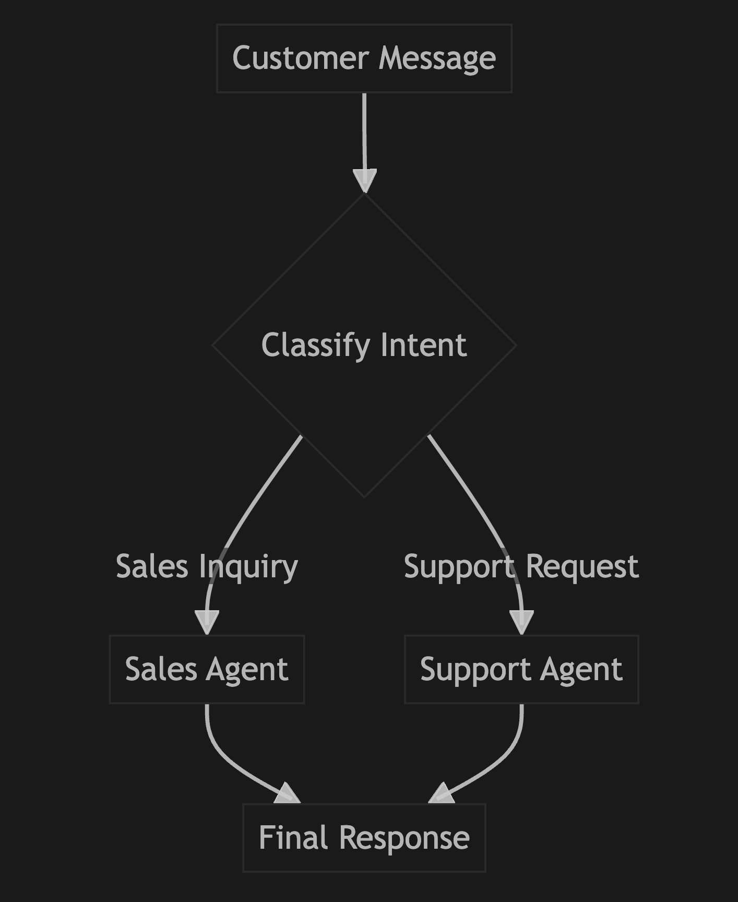
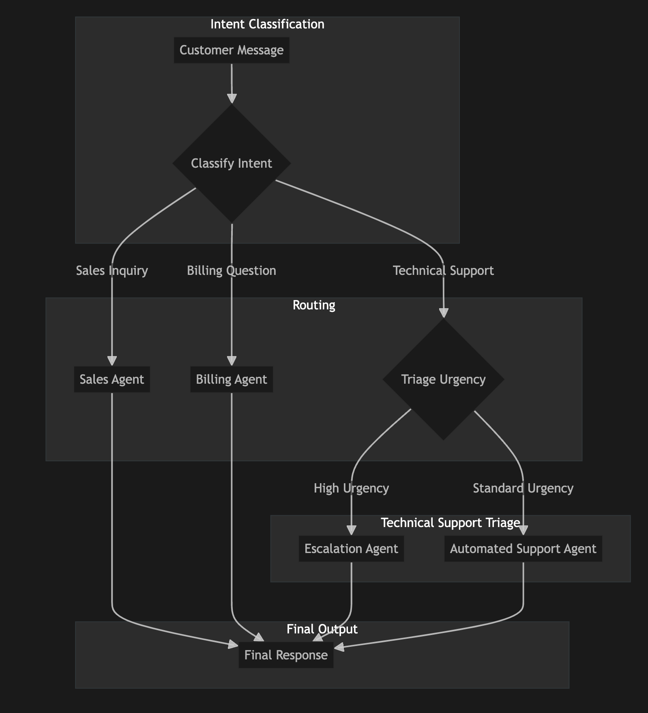

# Proposal: An Intelligent Customer Inquiry Routing System

## Introduction

This document proposes the development of an intelligent system to automate the routing of customer inquiries. The goal is to efficiently classify incoming messages and direct them to the appropriate department or handling process, improving response times and customer satisfaction.

We outline a two-phased approach: starting with a foundational workflow and then extending it to an advanced system with sophisticated triage capabilities.

---

## Phase 1: Foundational Workflow - Customer Inquiry Router

This initial system will act as a smart receptionist. It will analyze a customer's message to determine their intent and route them to the correct department.

### Workflow Diagram

### Workflow Steps

1.  **Input:** A customer message (e.g., "I'm interested in your pricing plans," or "I can't log into my account.").
2.  **Classify Intent:** A **Classification Agent** determines if the message is a **Sales Inquiry** or a **Support Request**.
3.  **Conditional Routing:** The workflow uses the classified intent to route the request:
    *   If **Sales Inquiry** ➞ **Sales Agent**.
    *   If **Support Request** ➞ **Support Agent**.
4.  **Generate Response:**
    *   The **Sales Agent** provides a friendly, sales-oriented response.
    *   The **Support Agent** offers initial assistance for support issues.
5.  **Output:** A tailored response is delivered to the customer.

---

## Phase 2: Advanced Workflow - Smart Triage System

Building upon the foundational workflow, this advanced system introduces more granular classification and a multi-step triage process for technical support issues.

### Workflow Diagram

### Workflow Steps

1.  **Input:** A customer message.
2.  **Classify Intent:** The first agent classifies the inquiry's purpose into one of three categories: **Sales Inquiry**, **Technical Support**, or **Billing Question**.
3.  **Initial Routing:**
    *   If **Sales Inquiry** ➞ **Sales Agent** (process ends).
    *   If **Billing Question** ➞ **Billing Agent** (process ends).
    *   If **Technical Support** ➞ **Triage Urgency**.
4.  **Triage Urgency (Technical Support only):** A second agent analyzes the message to determine its urgency level: **High** or **Standard**.
5.  **Secondary Routing (Urgency-based):**
    *   If **High Urgency** ➞ **Escalation Agent**.
    *   If **Standard Urgency** ➞ **Automated Support Agent**.
6.  **Generate Response:**
    *   **Sales Agent:** Provides links to pricing or sales contacts.
    *   **Billing Agent:** Directs users to their account dashboard.
    *   **Escalation Agent:** Creates a high-priority support ticket and notifies the user that a human agent will assist shortly.
    *   **Automated Support Agent:** Offers standard solutions or links to FAQs (e.g., "Have you tried restarting? Here’s a link to our documentation.").

---

## Key Benefits

*   **Increased Efficiency:** Automates the manual sorting of customer inquiries, freeing up team members for more complex tasks.
*   **Improved Customer Experience:** Provides faster, more consistent, and more accurate responses, leading to higher satisfaction.
*   **Scalability:** Creates a flexible and modular framework that can be easily expanded with new categories, agents, and tools over time.
*   **24/7 Availability:** Offers immediate, automated responses and routing even outside of standard business hours.

## Proposed Technology Stack

*   **Orchestration:** LangGraph for building the stateful, multi-agent workflows.
*   **Language Models:** Large Language Models (LLMs) for classification, analysis, and response generation.
*   **Data Validation:** Pydantic for ensuring structured and consistent data exchange between workflow components.
